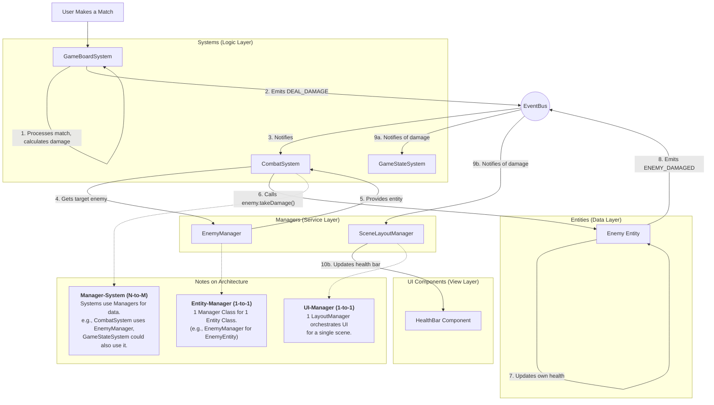

# Phaser.js Game Template

A production-ready template for building scalable and maintainable Phaser.js games using a modern Entity-Manager-System (EMS) architecture.

## Core Principles

-   **Separation of Concerns**: Game logic (`systems`), data (`entities`), and UI (`components`/`managers/layout`) are cleanly separated.
-   **Event-Driven**: Systems communicate via a global `EventBus` for decoupled architecture.
-   **Service Locator**: Provides centralized access to shared services and managers.
-   **Component-Based UI**: UI elements are encapsulated as self-contained `Phaser.GameObjects.Container` classes.
-   **Scalable Layouts**: A powerful `LayoutManager` handles all positioning and styling, ensuring responsiveness with zero hardcoded values.

## Architecture & Data Flow

The template follows a strict data flow to ensure clarity and maintainability.

### Directory Structure

-   `src/`
    -   `components/`: Reusable UI components (e.g., `TopBar`, `TileBoard`). Each is a self-contained `Container`.
    -   `configs/`: All game configurations, constants, and presets. Tweak gameplay from here.
    -   `entities/`: Plain data objects representing game items (e.g., `Enemy`, `Player`, `Tile`).
    -   `features/`: Encapsulated game features like asset management.
    -   `managers/`: Singleton services that manage collections of entities (`EnemyManager`) or complex systems (`LayoutManager`).
    -   `scenes/`: Phaser `Scene` classes (`Boot`, `Preload`, `Main`). The `MainScene` orchestrates the game.
    -   `services/`: Core services like the `EventBus` and `ServiceLocator`.
    -   `systems/`: Contains all the game logic. Systems operate on entities and are driven by events.
    -   `utils/`: Generic helper functions and constants (e.g., `anchors`).

## How to Get Started

1.  **Define Entities**: Create your game's data classes in `entities/`.
2.  **Create Managers**: In `managers/`, build classes to manage your entities.
3.  **Implement Systems**: Add game logic to `systems/`. Use the `EventBus` for communication and the `ServiceLocator` to access managers.
4.  **Build UI**: Create UI elements in `components/` and use `managers/layout/SceneLayoutManager.ts` to place them on the screen.
5.  **Configure**: Adjust game mechanics and assets in `configs/`.
6.  **Orchestrate**: Tie everything together in `scenes/MainScene.ts`.

